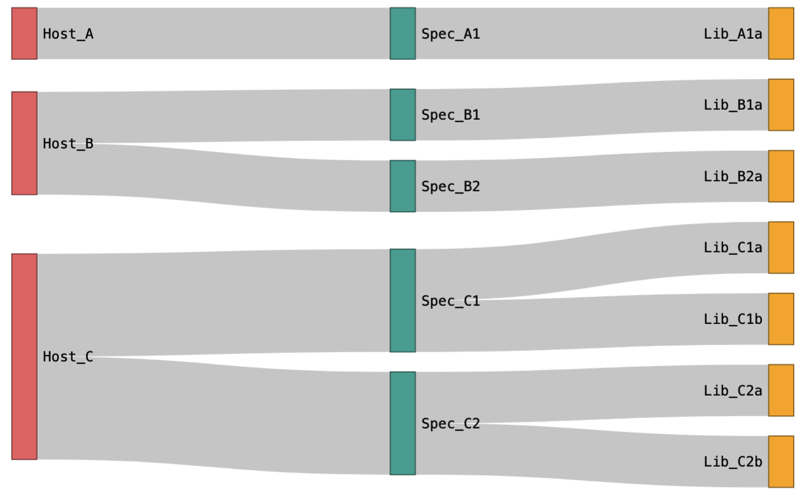

## PMO Basics 

The PMO format was developed to be very flexible and allow for as much information about samples and the amplicon analysis of these samples but there is a set of minimum required information that is needed. The required information in order to create a PMO can be broken down into several categories: 

* Sample meta information 
  * This is information about the sample/specimen that you have collected (dried blood spot, whole blood sample, mosquito mid-gut, etc) 
* Information about sequencing/library run 
  * This is information about what sequencing technology was used, what amplicon panel used (see below)
* Amplicon panel information
  * This the information about the primer set used in the experiment and the associated targeted genomes
* The amplicon analysis/results
  * This is the information about the pipelines used and the final results for the experiment 

This information maybe stored in several different tables and information for several different categories may be stored in the same table. Some of this information may be reused several times in different PMO for different experiments especially the panel and genome information. 

## Sample Identifiers 

There are several different "samples" information that can be stored within a PMO and therefore there are several different identifiers that go along with this information and can be a source of confusion. 

*  **host_subject_name** 
    * This is an identifier for a person/patient/individual of which there may be multiple specimens collected from over time (e.g. a longitudinal cohort where a person is followed for several years or therapeutic efficacy studies (TES) where there are several collections over a couple of days/weeks, etc)
*  **specimen_name**  
    * This is an identifier for a specific biological sampling from a person, it may be a dried blood spot, blood sample, urine sample, etc from which you will performed targeted amplicon sequencing on, if you have collected a only one specimen from a person, then you will only have one specimen_name per host_subject_name while people who have multiple specimens collected will have several **specimen_name**s per **host_subject_name** 
*  **library_sample_name** 
    * This is an identifier for a specific targeted amplicon sequencing run/DNA extraction, if you have performed sequencing in replicates or had to do a new extraction/run for a specimen, you will have multiple **library_sample_name**s for the same specimen  

Each of these identifiers should be unique within the PMO dataset, for example even if a **specimen_name** was sequenced several times, the **library_sample_name** should be unique even if ran on different plates, within the samplesheet itself they may have the same name but once being entered into a PMO, should have a unique **library_sample_name**. This occurs most frequently with positive controls, e.g. if sequenced **specimen_name** 3D7 multiple times, depending on how you set up your experiment people may have named it 3D7 each time. 

* Project_Info 
    * project_name 
    * project_description  

* Genome 
    * name
    * genome_version
    * taxon_id
    * url 

* Panel 
    * panel_name
    * target_name
    * forward_primer
    * reverse_primer 

* Specimen 
    * specimen_name 
    * specimen_taxon_id
    * host_taxon_id
    * collection_date
    * collection_country 

* Sequencing info 
    * sequencing_info_name
    * seq_platform
    * seq_instrument_model
    * library_layout
    * library_strategy
    * library_source
    * library_selection

* bioinformatics information 
  * bioinformatics_run_name
  * program
  * program_version 

* amplicon data 
  * library_sample_name
  * target_name
  * seq
  * reads 

